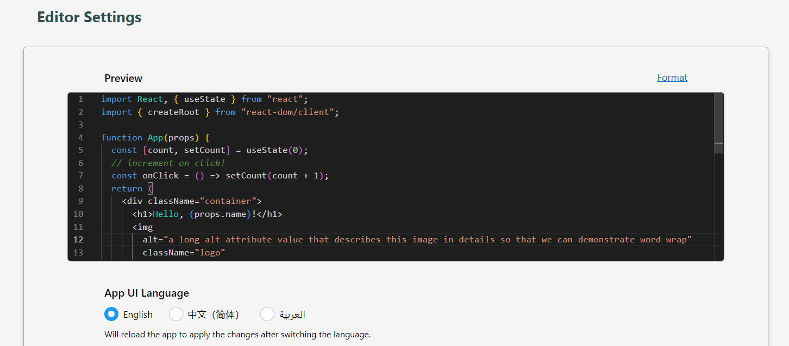

# Internationalization (I18n)

import LiveCodes from '../../src/components/LiveCodes.tsx';

LiveCodes currently supports UI internationalization. By default, the UI language will be automatically detected based on your browser settings.

You can easily switch between supported UI languages in the [Editor Settings](./editor-settings.md) screen, allowing you to explore and use LiveCodes in your preferred language!

If you are interested in contributing to the translation of LiveCodes, please refer to the [I18n Contribution Guide](https://github.com/live-codes/livecodes/blob/develop/docs/docs/contribution/i18n.md).



Demo:

<LiveCodes template="javascript" config={{appLanguage: 'auto'}}></LiveCodes>

## Using SDK

Set the [configuration object](../configuration/configuration-object.md) property [`appLanguage`](../configuration/configuration-object.md#applanguage) to a supported language code.

```js
import { createPlayground } from 'livecodes';

createPlayground('#container', { template: 'javascript', config: { appLanguage: 'auto' } });
```

## Using query params

Add the [query parameter](../configuration/query-params.md) `appLanguage` with your preferred language code.

https://livecodes.io?template=javascript&appLanguage=auto

## Related

- [User Settings](./user-settings.md)
- [Editor Settings](./editor-settings.md)
- [Query params](../configuration/query-params.md)
- [I18n Contribution Guide](https://github.com/live-codes/livecodes/blob/develop/docs/docs/contribution/i18n.md)